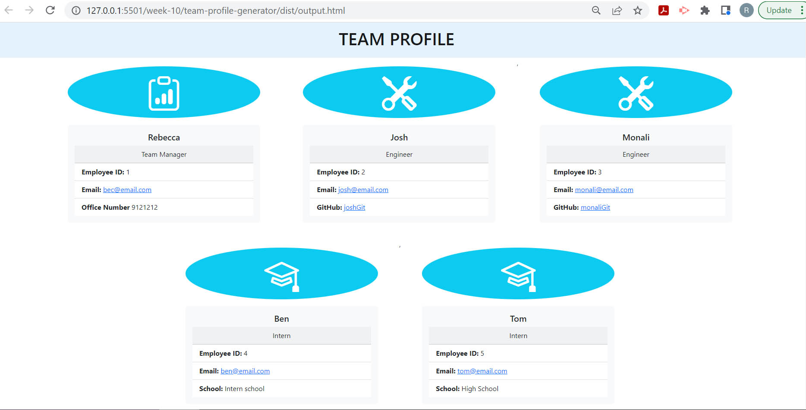
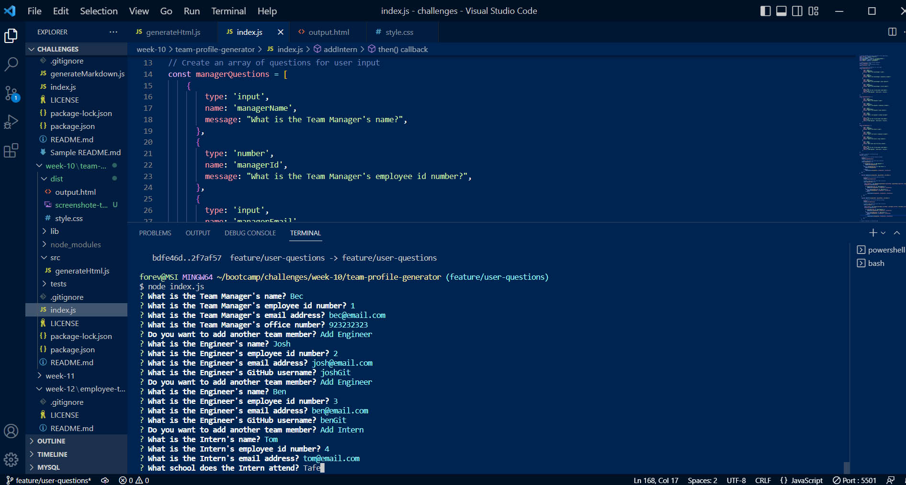

# Week Ten Challenge: Team Profile Generator

## Description

This repository is where I build code to create an app to generate a team profile html file based on user prompts.

## Installation

N/A

## Usage

Run node.js to initiate the Team Profile generator. Answer the user prompts to generate the information to fill out the html output file.

Link to walkthrough video: (https://drive.google.com/file/d/14q0wq8nmFR-yRSFkS7v0ndKBVwVPBoQ3/view)

## Credits

The following resources were referenced to ensure best practice and adherence to appropriate conventions:

Inquire documentation via npm: (https://www.npmjs.com/package/inquirer) 

Jest documentation via npm: (https://www.npmjs.com/package/jest)

Bootstrap CSS Framework: (https://getbootstrap.com/)
Bootstrap Documentation: (https://getbootstrap.com/docs/5.2/getting-started/introduction/)

Common js functions and parameters, for loops and arrays: JS CheatSheet by HTML CheatSheet (https://htmlcheatsheet.com/js/)

## License

Licensed under the standard MIT license. Please refer to the license in the repo for more information.